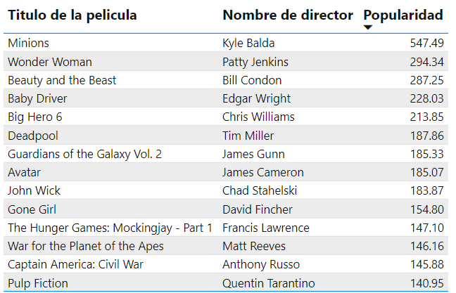
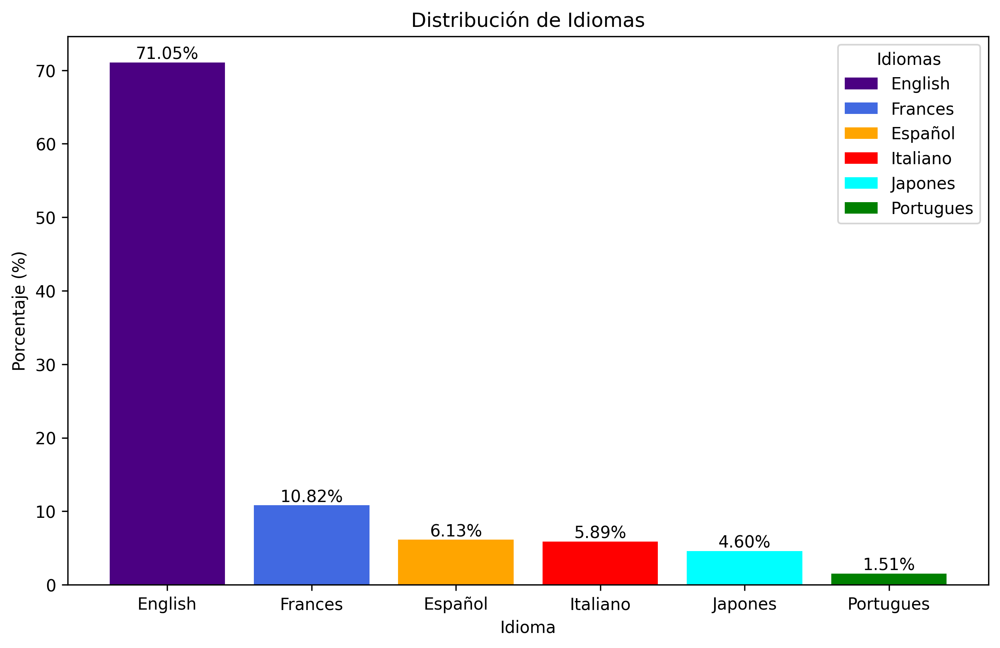

# Sistema de Recomendación de Películas

## Descripción

Este proyecto busca desarrollar un modelo de recomendación que sugiera 5 películas similares o relacionadas a una película dada por el usuario. Se utilizan diversas herramientas de ciencia de datos, como ingeniería de datos, estadística y machine learning.

## Tabla de Contenido

1. [Introducción](#introducción)
2. [Librerías de Python](#librerías-de-python)
3. [Metodología](#metodología)
   - [ETL](#etl)
   - [EDA](#eda)
   - [Modelamiento de Datos](#modelamiento-de-datos)
4. [Estructura del Proyecto](#estructura-del-proyecto)
5. [Uso y Ejecución](#uso-y-ejecución)
6. [Resultados y Conclusiones](#resultados-y-conclusiones)
7. [Autores](#autores)

## 1. Introducción

En este proyecto, la institución HENRY nos proporciona dos datasets para comenzar mediante el uso de Python:

- `movies_dataset.csv`: Contiene información esencial de cada película, como título, idioma, país, género y popularidad, los cuales permiten generar una clasificación y posteriormente una selección de películas similares.
- `credits.csv`: Contiene una lista de actores y el personal de producción de cada película.

El desarrollo del modelo sigue una metodología dividida en tres partes: extracción, transformación y carga de datos (ETL), análisis exploratorio de datos (EDA) y finalmente el modelamiento.

## 2. Librerías de Python

Las principales dependencias de Python utilizadas en este proyecto son:

- `numpy`
- `pandas`
- `scikit-learn`
- `FastAPI`
- `uvicorn`

## 3. Metodología

### ETL

Se realizó la carga de los datasets iniciales, que fueron manipulados utilizando `pandas`, `re`, y `numpy`. Como resultado, se depuraron y redujeron los datasets, unificándolos en un solo dataset global mediante la columna `id`.

### EDA

Con los datos previamente tratados, el análisis se centró en dos parámetros clave para la recomendación de películas: la popularidad y el idioma hablado. Dado que el procesamiento de datos a nivel local presentaba limitaciones, fue esencial obtener una muestra representativa de películas para entrenar el modelo de manera eficiente.

Una recomendación efectiva se fundamenta en títulos conocidos, ya que estos tienen un mayor impacto en las decisiones de los usuarios. La popularidad de una película, generalmente medida a través de votos y la recepción del público, fue utilizada para identificar los títulos más relevantes. A continuación, se presenta una tabla con los títulos más emblemáticos de este conjunto de datos:

Además, el idioma desempeña un papel crucial en el filtrado de películas. Aunque existe una gran variedad de idiomas en el dataset, solo unos pocos son predominantemente representativos. Esto se puede observar en el siguiente diagrama de barras:

Como resultado, estos dos parámetros fueron utilizados como criterios de filtrado para simplificar el dataset, permitiendo procesar los datos de acuerdo con los recursos disponibles y crear un producto mínimo viable (MVP).

### Modelamiento de Datos

Con un dataset representativo en términos de popularidad e idiomas, se aplicó el modelo de similitud del coseno para comparar parámetros más específicos de una película, basándose en 4 atributos: título, descripción, género y actores. El sistema sugiere 5 títulos diferentes al inicial, lo cual puede probarse mediante FastAPI.

## Estructura del Proyecto

- `Datasets/`: Contiene los archivos generados en el proceso, siendo `df_test` el utilizado por la API.
- `Images/`: Archivos PNG de las visualizaciones más representativas.
- `Notebooks/`: Código Python en Jupyter Notebooks para ETL y modelado.
- `Reports/`: Incluye solo el informe EDA.
- `Src/`: Código Python de la FastAPI y dependencias para el despliegue en formato `.txt`.
- `README.md`: Descripción general del proyecto.

## Uso y Ejecución

1. Ejecutar el script de ETL en la carpeta `Notebooks`.
2. Realizar el análisis exploratorio de datos (EDA) en la sección de `Reports`.
3. Ejecutar el modelo ubicado en la carpeta `Notebooks`.
4. Ingresar el nombre de una película o realizar pruebas desde la API creada.

## Resultados y Conclusiones

- Para desarrollar un prototipo de modelado (machine learning) no se requieren necesariamente grandes recursos computacionales, sino un correcto diseño y selección de métodos para alcanzar un MVP.
- El proyecto demostró el gran potencial de los modelos de machine learning, destacando la importancia de la estructura lógica subyacente.

## Autores

Este proyecto fue realizado por Pablo Micolta ([pbcsm17@gmail.com](mailto:pbcsm17@gmail.com)).
